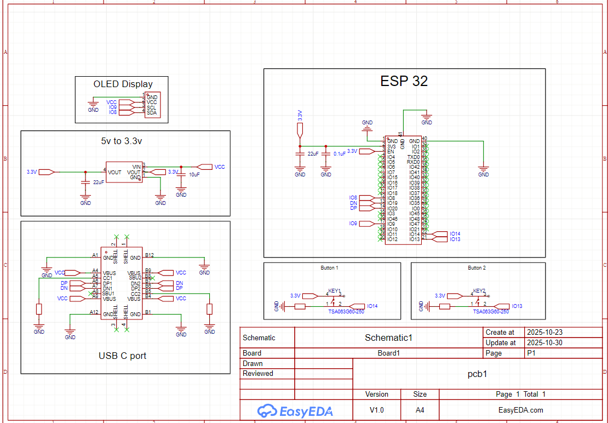

# Custom ESP32 Handheld Console

A portable gaming handheld designed from scratch.

## The Device

## Engineering Focus
This project focuses on **Hardware Engineering** and **Board Bring-up**:
1.  **PCB Design:** Designed a custom 2-layer PCB in EasyEDA, handling power delivery and signal routing for the ESP32-S3.
2.  **Assembly:** Hand-soldered SMD components and the microcontroller module.

## Hardware Design
**Schematic:** 
 
*(Designed in EasyEDA)*

## Firmware Integration
Ported open-source game logic (Dino Run, Tic-Tac-Toe) using Gemini to the custom pinout to stress-test the hardware.
- **Display Protocol:** I2C (Pins 8/9).
- **Input Handling:** Direct GPIO polling (Pins 13/14).
